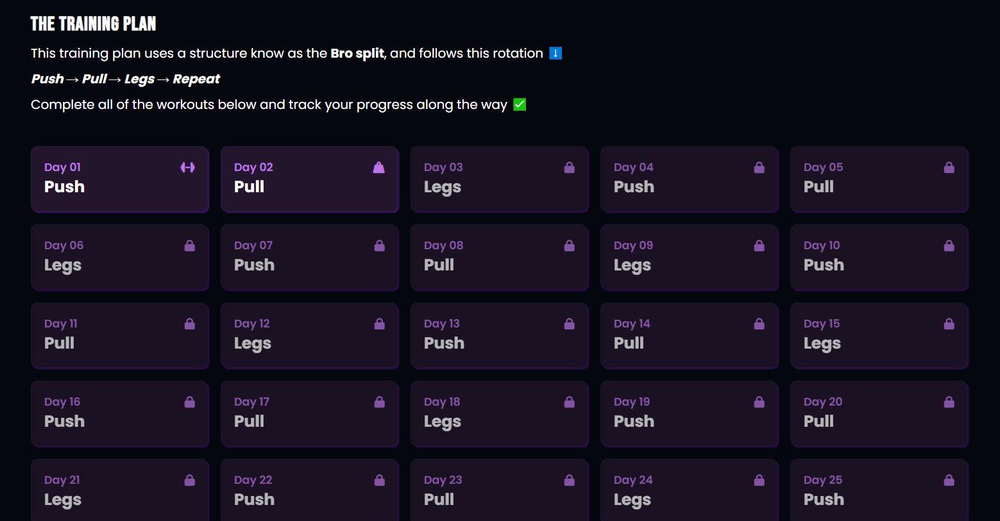
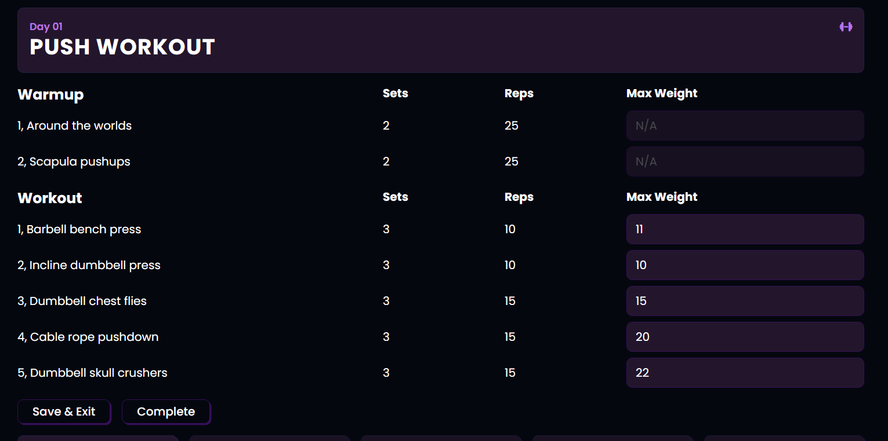

# 🏋️‍♀️ WorkoutProgram

**WorkoutProgram** is a web application that guides users through a 30-day training program, split into **Push**, **Pull**, and **Legs** routines. Progress is saved locally, and workouts unlock progressively as you complete each day.
This project was built as a practical exercise to apply React, Vite, LocalStorage and clean code when possible.

## 🚀 Demo

Coming soon...

## 📸 Screenshots

  


## ✨ Features

- 🔓 Progressive workout unlocking
- 💾 Save progress using `localStorage`
- 🏋️ Track sets, reps, and weight for each exercise
- ❓ Modal with exercise instructions and descriptions
- 💡 Clean and responsive UI

## 🧰 Technologies Used

- **React** – Component-based UI
- **Vite** 
- **JavaScript (ES6+)**
- **CSS** 
- **Font Awesome** – Icons for exercises and status
- **LocalStorage** – Frontend-only persistence


## 📦 Installation

1. Clone the repository:

```bash
git clone https://github.com/valuvel17/WorkoutProgram.git
cd WorkoutProgram
```
2. Install dependencies:
```bash
npm install
```
3. Start the development server:
```bash
npm run dev
```

